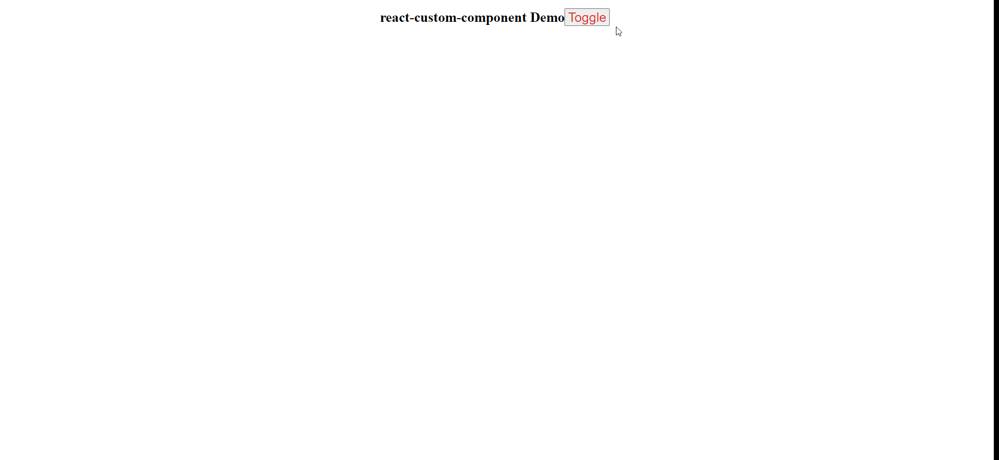
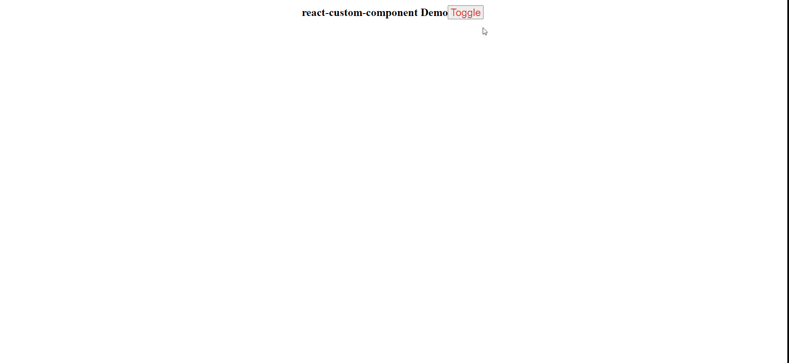
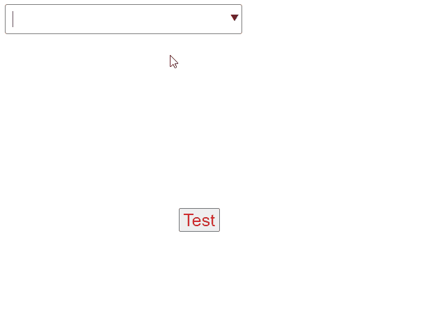

# react-custom-component

[![npm package][npm-badge]][npm]

## Components

```js
import {
  ScrollBar,
  FancyButton,
  FancyButtonGroup,
  Slider,
  Modal,
  Loader,
} from "@evanhongo/react-custom-component";
```

<br />

### **ScrollBar**

|  Props   |   Type   | Description               |
| :------: | :------: | :------------------------ |
|  width   | {string} | Width of the progress bar |
| children |  {node}  | Primary content           |

<br />

### **Slider**

|  Props   |   Type   | Description                                        |
| :------: | :------: | :------------------------------------------------- |
|  isOpen  |  {bool}  | Controls whether or not the slider is displayed    |
|  width   | {string} | Width of the slider                                |
| postion  | {string} | Postion of the slider <br />Enums: **left, right** |
|  style   | {object} | Custom styles                                      |
| children |  {node}  | Primary content                                    |

<br />

### **FacncyButton, FacncyButtonGroup**

|  Props   |   Type   | Description     |
| :------: | :------: | :-------------- |
|  style   | {object} | Custom styles   |
| children |  {node}  | Primary content |

<br />

### **Modal**

|  Props   |   Type   | Description                                    |
| :------: | :------: | :--------------------------------------------- |
|  isOpen  |  {bool}  | Controls whether or not the Modal is displayed |
| onClose  |  {func}  | Called when a close event happens              |
|  style   | {object} | Custom styles                                  |
| children |  {node}  | Primary content                                |

### **Modal.Header, Modal.Content, Modal.Actions**

|  Props   |   Type   | Description     |
| :------: | :------: | :-------------- |
|  style   | {object} | Custom styles   |
| children |  {node}  | Primary content |

<br />

### **Loader**

| Props |   Type   | Description                                      |
| :---: | :------: | :----------------------------------------------- |
| type  | {string} | Loading style <br/> Enums: **rolling, spinning** |
| style | {object} | Custom styles                                    |

<br />

### **Dropdown**(Only for multiple selection)

|  Props   |   Type    | Description                                                                   |
| :------: | :-------: | :---------------------------------------------------------------------------- |
| options  | {arrayOf} | Array of Dropdown.Item props e.g. `{ key: '', text: '' }`                     |
|  value   | {arrayOf} | Current value array                                                           |
| onChange |  {func}   | Called when the user attempts to change the value <br/> onChange(data: array) |
|  style   | {object}  | Custom styles                                                                 |

<br />

### **Popup**

|  Props  |   Type   | Description                                                |
| :-----: | :------: | :--------------------------------------------------------- |
| content |  {node}  | Element to be rendered for the popover                     |
| trigger |  {node}  | Element to be rendered in-place where the popup is defined |
|  style  | {object} | Custom styles                                              |

---

## Demo

<br />


<br />
<br />
<br />

```js
<Modal isOpen={isOpen} onClose={() => setIsOpen(false)}>
  <Modal.Header style={{ fontSize: "30px" }}>Warning!!～</Modal.Header>
  <Modal.Content>
    <p style={{ fontSize: "30px" }}>Are you sure?</p>
  </Modal.Content>
  <Modal.Actions>
    <input
      type="button"
      value="No"
      style={{
        marginRight: "10px",
        width: "100px",
        height: "50px",
        fontSize: "20px",
      }}
      onClick={() => setIsOpen(false)}
    />
    <input
      type="button"
      value="Yes"
      style={{ width: "100px", height: "50px", fontSize: "20px" }}
      onClick={() => setIsOpen(false)}
    />
  </Modal.Actions>
</Modal>
```



<br />

```js
const [selected, setSelected] = useState([]);
<Dropdown
  options={[
    { key: 1, text: "123" },
    { key: 2, text: "234" },
    { key: 3, text: "345" },
    { key: 4, text: "ABC" },
    { key: 5, text: "DEF" },
    { key: 6, text: "GHI" },
  ]}
  value={selected}
  onChange={(key) => {
    setSelected(key);
  }}
/>;
```

```js
<Popup
  trigger={
    <button
      style={{
        fontSize: "30px",
        color: "#df2929",
        cursor: "pointer",
        userSelect: "none",
      }}
    >
      Test
    </button>
  }
  content={<div style={{ fontSize: "30px" }}>Hello World</div>}
  style={{ margin: "300px 300px" }}
/>
```



[npm-badge]: https://img.shields.io/npm/v/npm-package.png?style=flat-square
[npm]: https://www.npmjs.org/package/npm-package
